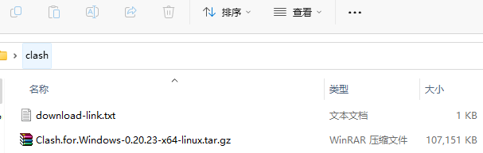
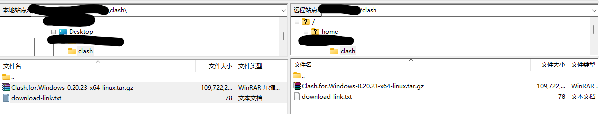
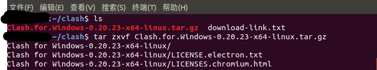
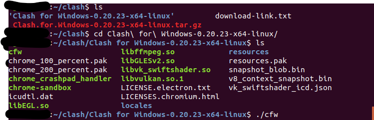
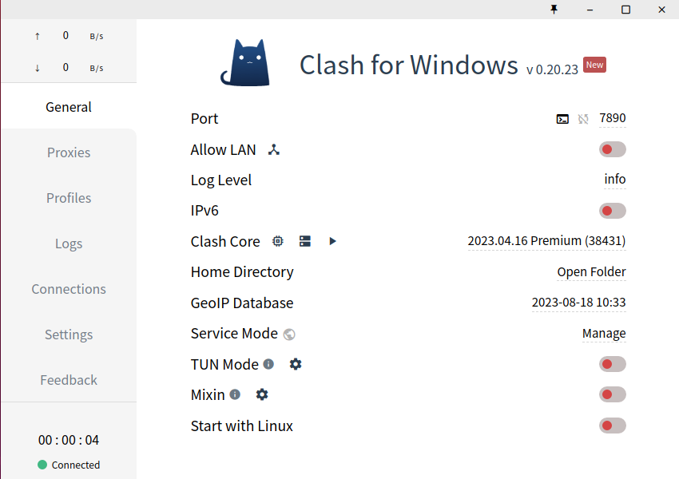
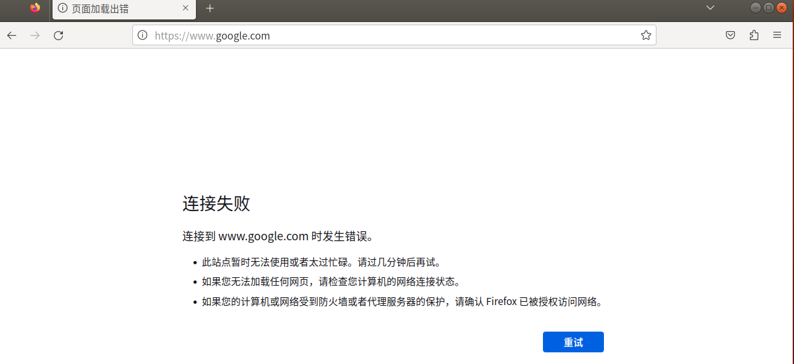
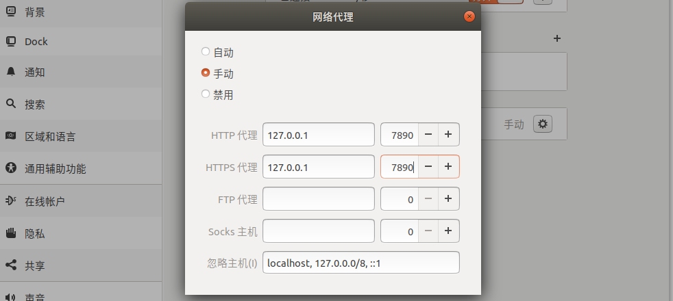
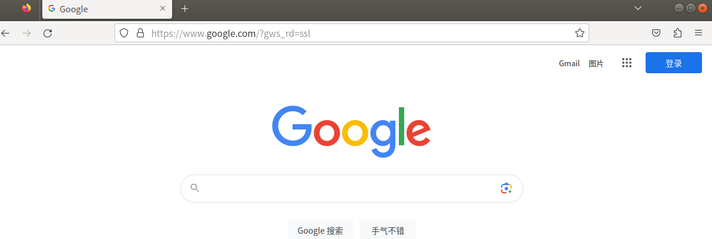

# Readme

记录在ubuntu上使用clash，用于下载学习资源的过程

## 前提

能够获取到clash的订阅链接，否则无法成功访问google

## 环境

win11

ubuntn18.04 网络连接选择的是NAT模式，本身是可以正常上网的

FileZilla

## 下载

在github上找到的是Clash.for.Windows-0.20.23-x64-linux.tar.gz，感谢分享者

下载压缩包到win11系统

Clash.for.Windows-0.20.23-x64-linux.tar.gz是clash压缩包

download-link.txt里放的是clash订阅链接，请自寻渠道获取



## 传文件到ubuntu

通过FileZilla连接到ubuntu，把文件传入到ubuntu



## 解压

在ubuntu内解压Clash.for.Windows-0.20.23-x64-linux.tar.gz

```
tar zxvf Clash.for.Windows-0.20.23-x64-linux.tar.gz
```



## 打开clash

进入到解压目录，打开clash



如下

注意Port端口是7890，后面需要在网络代理里使用这个端口



在clash的Profiles栏输入订阅链接，并下载成功

目前在ubuntu里访问www.google.com还是失败



## 设置ubuntu网络代理

选择手动，输入如下



在ubuntu上访问www.google.com


